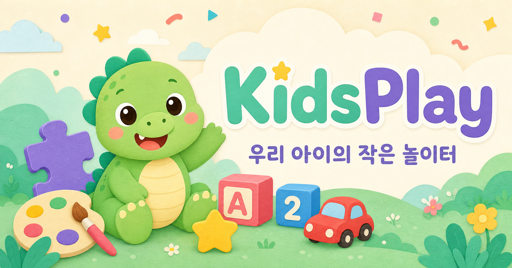
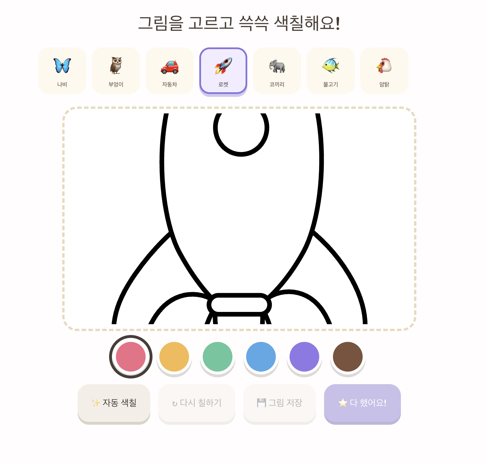

# KidsPlay · 꼬마 놀이터

> 아이가 혼자서도 안전하고 즐겁게 놀며 배울 수 있는 웹 기반 교육 놀이 공간<br>
> A safe, playful web learning space made for young children.

[한국어](#한국어) · [English](#english)



## 한국어

KidsPlay는 **2~7세 아이들**을 위한 교육용 웹 게임 플랫폼입니다. 오래된 컴퓨터나 태블릿도 아이 전용 놀이 기기로 활용할 수 있도록, 큰 버튼과 쉬운 조작, 따뜻한 색감으로 만들었습니다. 설치 없이 브라우저에서 바로 시작할 수 있고, 한 번 접속한 뒤에는 오프라인에서도 주요 기능을 사용할 수 있습니다.

### 주요 기능

- 색칠 놀이, 퍼즐, 짝꿍 찾기, 알파벳, 숫자, 동물, 탈것, 공룡, 모양, 그림 맞추기 등 **18가지 놀이**
- 나비, 동물, 로켓, 자동차, 기차, 성, 로봇 등 **14가지 색칠 그림**
- 2~3세, 4~5세, 6~7세 연령에 맞춘 난이도 조절
- 한국어와 영어 지원
- 별, 스티커와 기기 내 진행 기록 저장
- 마우스, 터치, 키보드로 조작 가능
- PWA 및 오프라인 실행 지원
- 1366×768 구형 노트북용 한 화면 레이아웃과 로컬 그림 아이콘
- 10단계 미로, 12종 동물 직소, 10문제 더하기 카드, 5단계 숫자 선 잇기, 별 팡팡, 5초 기록제 모양 달리기, 10단계 숨은 모양 게임
- 광고와 외부 링크 없이 아이가 놀이에 집중할 수 있는 화면

### 아이를 위한 안전 설계

키즈 모드에서 부모 화면으로 돌아가려면 화면 위쪽의 자물쇠를 1초간 누른 뒤 간단한 곱셈 문제를 풀어야 합니다. 아이가 우연히 설정 화면을 여는 일을 줄이기 위한 장치이며, 고정 비밀번호나 PIN은 사용하지 않습니다.

### 화면



### 체험하기

[KidsPlay 사이트 열기](https://kidsnara.pages.dev)

로그인이나 설치 없이 바로 놀 수 있습니다.

### 로컬에서 실행하기

Node.js 22.13 이상이 필요합니다.

```bash
npm install
npm run dev
```

검증과 프로덕션 빌드는 다음 명령으로 실행합니다.

```bash
npm test
npm run lint
npm run build
```

## English

KidsPlay is an educational web game platform for **children ages 2–7**. It is designed with large controls, simple interactions, and friendly colors so that even an older computer or tablet can become a dedicated play-and-learning device. Children can start in a browser with no installation, and core activities remain available offline after the first visit.

### Highlights

- **18 activities**, including coloring, puzzles, memory matching, alphabet, numbers, animals, vehicles, dinosaurs, shapes, and picture matching
- **14 coloring pages**, featuring butterflies, animals, rockets, cars, trains, castles, robots, and more
- Age-adjusted difficulty for ages 2–3, 4–5, and 6–7
- Korean and English language support
- Stars, stickers, and progress stored on the current device
- Mouse, touch, and keyboard controls
- PWA installation and offline support
- A single-screen layout and bundled picture icons for older 1366×768 laptops
- A 10-level maze, 12 animal jigsaws, 10-round addition cards, 5 connect-the-dots pictures, Pop Stars, a five-second record-based Shape Runner, and 10 hidden-shape rounds
- A focused child-friendly interface with no ads or external links

### Parent-friendly safety

To leave Kids Mode, an adult holds the lock button for one second and answers a simple multiplication question. This helps prevent children from opening settings by accident. There is no fixed PIN or password to remember.

### Screenshot


### Live demo

[Open KidsPlay](https://kidsnara.pages.dev)

No sign-in or install required — just open and play.

### Run locally

Node.js 22.13 or later is required.

```bash
npm install
npm run dev
```

Run the test, lint, and production build commands with:

```bash
npm test
npm run lint
npm run build
```

## Cloudflare Pages

Use `npm run build:pages` as the build command and `out` as the build output directory. Set the production branch to `main`.

## Tech stack

Next.js · React · TypeScript · Tailwind CSS · Cloudflare Pages / Workers · PWA

## Artwork credits

Coloring-page artwork sources and licenses are listed in [THIRD_PARTY_NOTICES.md](THIRD_PARTY_NOTICES.md).
